# Classical Controls - (with Transfer Function) 
- Broken into
  - Transfer function control (mmmm)
  - State space control (YAY)
- Basics
  - System/plant
    - Has an input and makes an output
    - 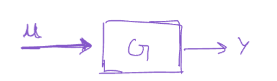
  - Open and closed loop
    - Uses controller to shape input to plant to get desired output
    - 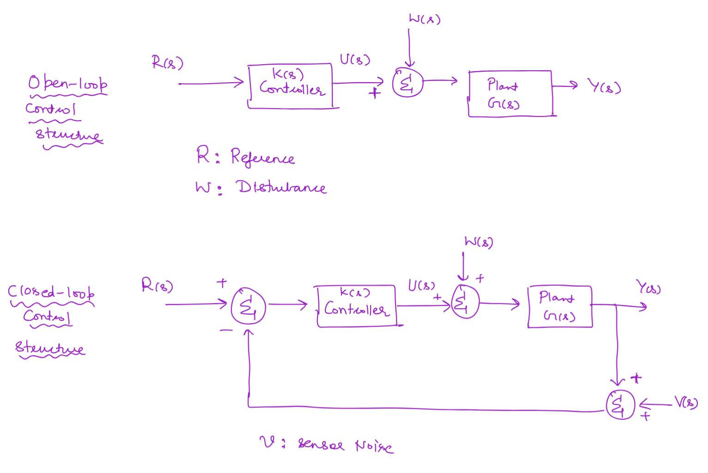
## Transfer Function
  - Linear
  - How a system responds (gain, phase) to different frequencies
  - Multiplication is convolution in time domain
  - 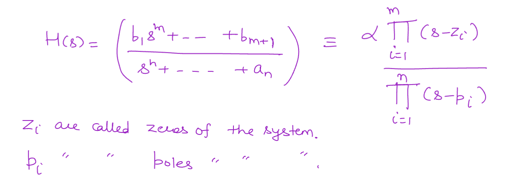
- **Poles**
  - Roots of denominator of TF
  - Drive response to infinity
  - Negative real part means decay
  - Pole locations
    - 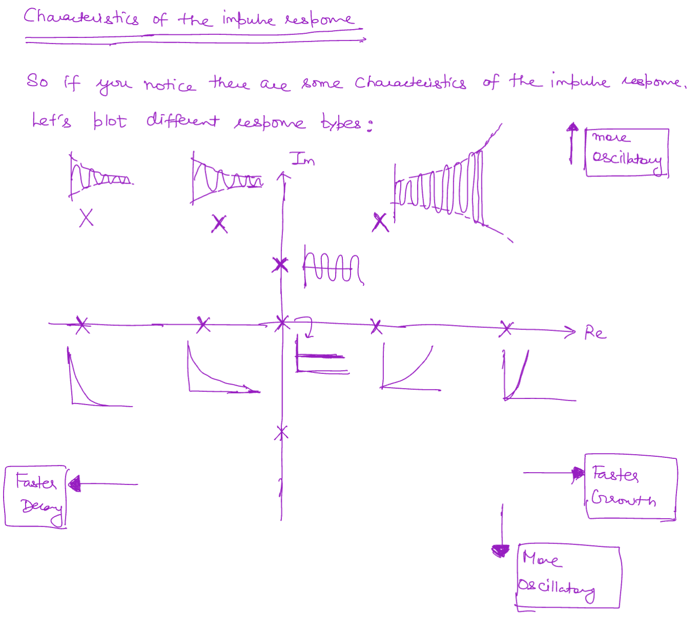
  - Real poles
    - Exponential growth or decay
  - Imaginary poles
    - Sinusoidal component 
  - Complex poles
    - Some combination of the above two
    - Sinusoid enveloped by exponential decay or growth
    - 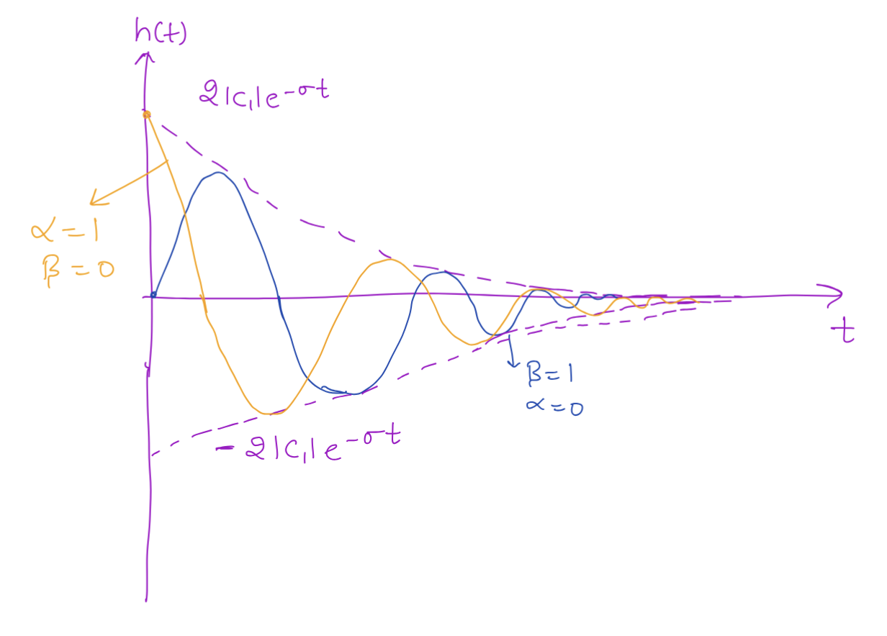
- **Zeros**
  - Roots of numerator of TF
  - Output becomes 0
  - Affect how much a pole contributes to the

### Stability
- Stable pole
  - Real{p} < 0
- Critically/marginally stable pole
  - Real{p} = 0
- Unstable
  - Real{p} > 0

### Steady State
-  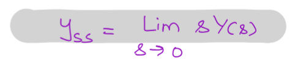
-  Exists If all poles are in left hand side
-  **Final Value Theorem**
   -  
   -  Steady state must exist for this to be true

<!-- ### BIBO
- Bounded input, bounded output
  - All real parts of poles are BIBO stable -->

## Controller Overview

- Response of input, disturbance, and noise all add linearly
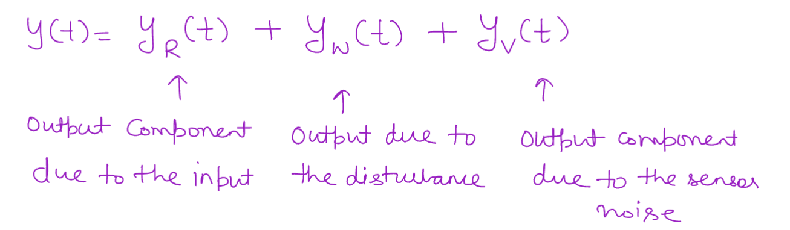

Good controller:
1. Basic checks
   - Stability (location of poles)
   - Robustness to modeling errors/disturbances (closed loop does this)
2. Steady state requirements
   - Tracking error
3. Transient Requirements
   - Rise time, overshoot, settling time, peak time
   - Analytic for 2nd order system
   - 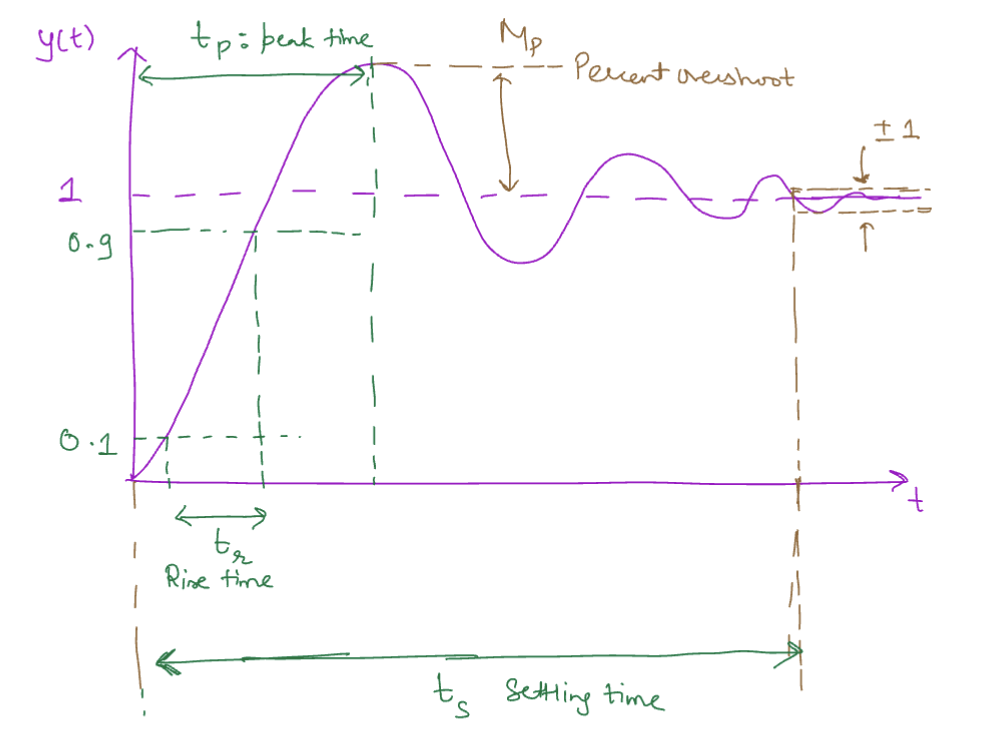
4. Objective/cost function (not as much in TF, mainly in state space) 
   - Obstacle avoidance, control effort 

### 2nd order system
- Full formula
  - 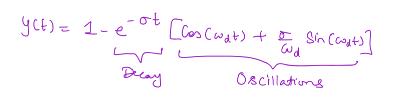
- Transfer function 
  - Damping coefficient $\eta$ in $H(s) = \frac{\omega_n^2}{s^2 + 2 \eta \omega_n s + \omega_n ^2}$ where $\omega_n > 0$
  - 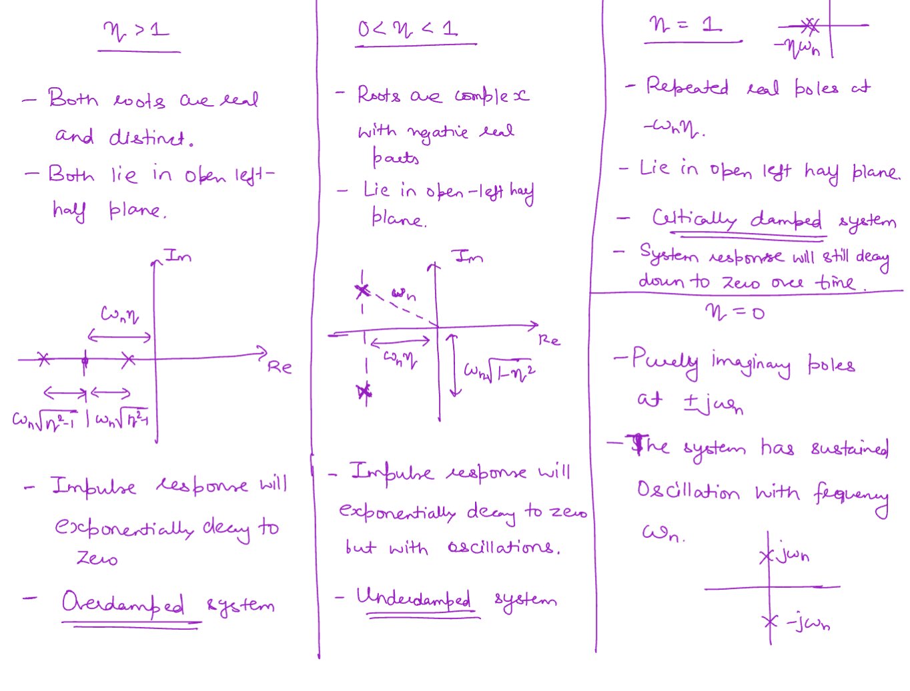
  - Want damping so it is stable
- Analytic transient specs

### Open vs Closed loop
- Open Loop
  - Bad at disturbance rejection
  - AND MODEL ERRORS 
- Closed loop deals with this
  - Good tracking, disturbance rejection, model error sensitivity
  - Poor with sensor noise
    - Filtering (observer)
    - Better sensors (less noise)
    - Multiple sensors (fusion)
  
## Control Design Techniques
The methods and tools used.

Key note: **hitting a gain of -1 ($\pm180\degree$) is bad and makes things flip to unstable**
(magnitude = $1$ AND phase = $\pm180\degree$ at the same time)

### Root Locus
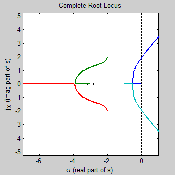
- Show poles for a specific gain of K
- Can change stability and response type (damped, undamped, etc.)
- **Helpful for transient specs**
- Applied when you have a specific "form" of a controller but need to adjust the gain as the last step to adjust the pole and zero locations
- Strategy for lead-lag
  - Design lead controller for transient specs
    - Angle condition ($180 \degree$) for poles and zeros
    - Magnitude condition for gain $K$
  - Design lag controller 
    - K basically unchanged since pole is approx at zero
    - Design ratio of pole and zero

### Bode Plot
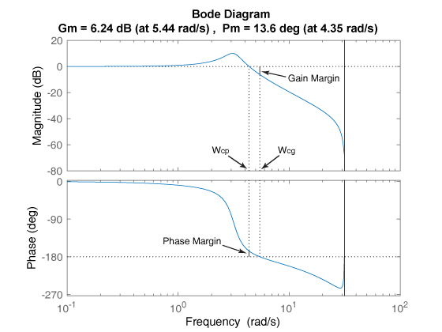
- **Helpful for steady state error**
- Magnitude and phase plots
- Can be experimental (system ID)
- Use just frequency response (no damping)
- Asymptotes
  - Just set $\omega$ to 0 or infinity and see where it leads
- Types of responses
  - 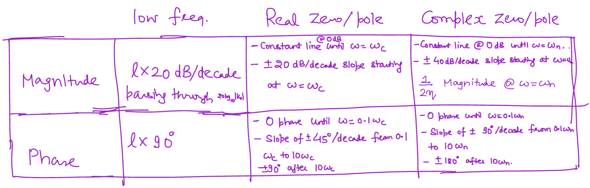
- **System ID**
  - Get TF of system based on slopes, intercepts, and asymptotes
    - Pole adds negative slope, negative phase
    - Zero adds positive slope, positive phase

- **Gain margin** - When exactly out of phase ($\pm 180\degree$), how much extra gain can it tolerate before I risk being at $-1 + 0j$ and it goes unstable
  - That is, if the response flips past 180, the output does not blow up since it is less than 1
- **Phase margin** - When exactly at a magnitude of 1, how much extra phase can I tolerate before I risk hitting $\pm 180\degree$ and becoming unstable (by being at $-1 + 0j$)
  - That is, if 
- **Bandwidth** - Magnitude when system responds at half power
  - Higher bandwidth freq means faster rise time ()
- Max phase added when pole and zero are FAR apart for lead and lag
- Strategy
  - High margins
    - Low gain margin
  - High bandwidth
    - Allows system to react to higher and higher reference frequencies
  - High gain at low freq
    - References mainly live here so we want the system to respond quickly to them
    - tracking/disturbance rejection
  - Close to -20dB slope at (gain) crossover freq

## Controllers

### Lead Controller
- Pole further left than zero, adds phase (and phase margin)
- To meet transient specs
- Large poles and zeros to move root locus to be more stable
- Increases bandwidth

### Lag Controller
- Pole further right than zero, subtracts phase
  - Pole almost at origin (integrator) to remove steady state error
- Avoids windup (integrator never forgets)
- Small poles and zeros to not affect transient specs

### Lead-lag controller
- For transient specs AND steady state tracking

### P controller

### PD controller

### PI controller

### PID controller

- **Step**

### PID

- $P$
  - Proportional to the error term
  - Risk of overshooting for gain too large and under-reacting if the gain is too small
- $D$
  - Rate of change of error term. Prevents overshooting by damping the system
  - Depending on the damping ratio it makes, there is some form of a second order system (over, under, critically damped, undamped) on the denominator of transfer function
- $I$
  - Integral of error term
  - P and PD can still have small offsets when the control effort exactly equals the error 
  - Rejects steady state error

- **PID**: u = Kp·e + Ki∫e dt + Kd·de/dt. Know what each term physically does (P = current error, I = eliminates steady-state error but risks windup, D = damps oscillation but amplifies noise). Integral windup and anti-windup (clamping, back-calculation) is a common follow-up question.
- **State-space controllability**: dual concept to observability — can you drive the state anywhere using available inputs? Controllability matrix [B, AB, A²B, ...] rank test. If uncontrollable, no amount of feedback gain fixes it, the mode just isn't reachable.
- **Pole placement**: choose feedback gain K such that eigenvalues of (A − BK) land at desired locations (Ackermann's formula for SISO). Direct but doesn't optimize any cost, just places poles wherever you ask.

# APPENDIX

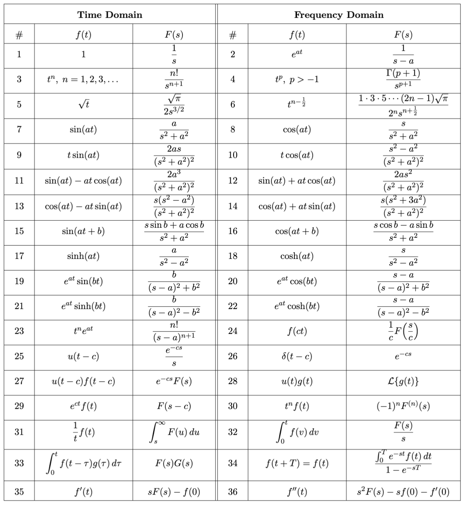
