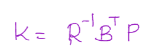
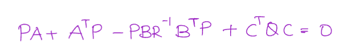
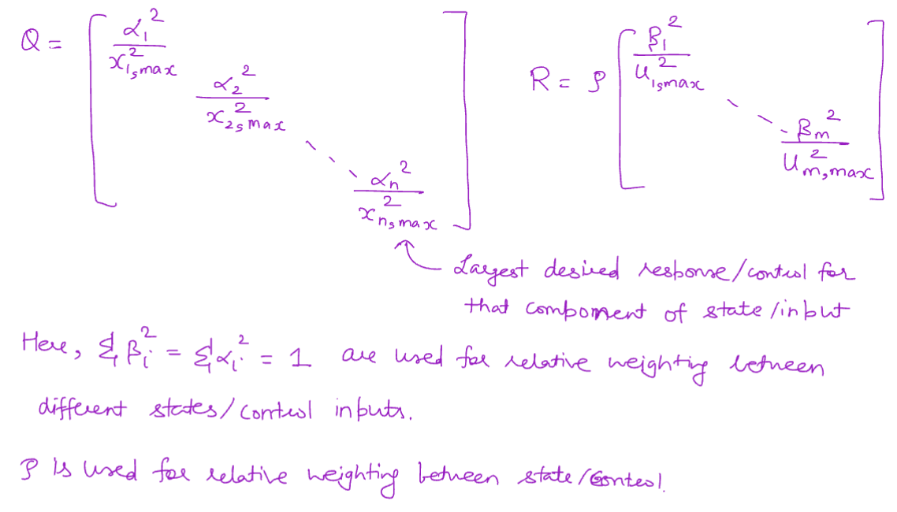

# Optimal CONTROL

## LQR
Already touched on in [guidance/optimization.md](../guidance/optimization.md). But this is for the actual control part

- Linear state feedback controller
- Optimal solution given by Positive Definite matrix $P$ solved by Ricatti equation
  - Assumes optimal drives input to 0 at $t = \infty$
  - Many solutions, only one PD solution ($P = P^T \ge 0$)

 

- Scaling of Q and R (intuition)
  - Normalize based on "max" input and output (squared)
  - 

