# Optimization

## Overview
[Wiki trajectory optimization](https://en.wikipedia.org/wiki/Trajectory_optimization)

[Paper](https://ojs.acad-pub.com/index.php/ADECP/article/view/2477/1185)

- Use cost/performance to get the BEST trajectory

### Formulation
- Dynamics/system 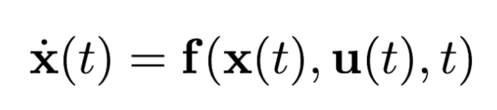
- Constraints
  - 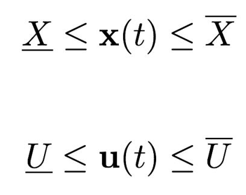
- Boundary conditions
  - 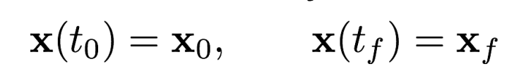
- Performance
  - 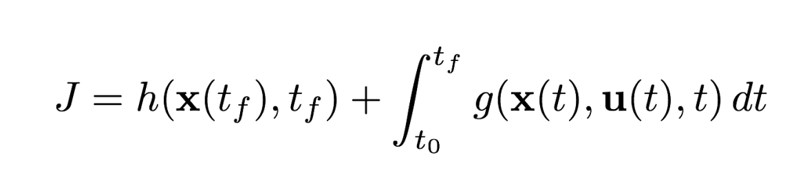
  - Terminal and running cost

### Constraints
**Conditions of optimality**
- Gradient is 0
- Hessian is Positive semidefinite (PSD) for unconstrained local min, PD for strict local/global

**Lagrangian**
- 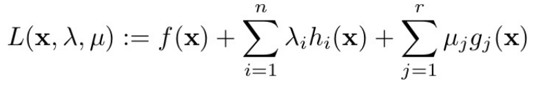
- With equality ($h$ term) and inequality ($g$ term) constraints
- Inequality lagrange multiplier $\mu$ may be 0 if constraint is not active (strictly equal) at optimality

## Indirect methods
- ***Optimize THEN Discretize***
- Solve adjoint differential equations
  - Not good for nonlinear
- Aside: Calculus of Variations (eww eww)
  - Fundamental theorem just means the variation is 0 at optimality
  - Helps derive terminal condition for PMP

### Analytic
**Hamiltonian**
- 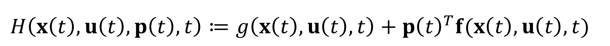
- Costate $p$ or $\lambda$ is how much optimal cost would change if $x$ is nudged
  - High means state is expensive to be wrong about
- Instantaneous cost and weighted cost of dynamics (via $p$) 
  
**Optimal trajectory (unbounded)**
- State evolves forward ( $\dot{x} = f(x,u,t)$ )
- Costate evolves backward from end of trajectory (so 2 point boundary)
- 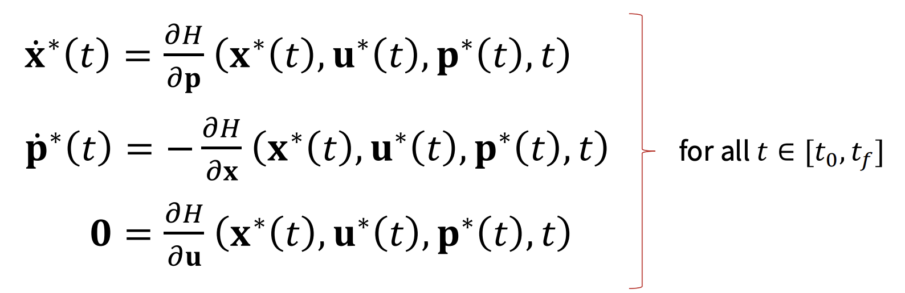
- With boundary conditions on costate (derived by CoV theorem)
- 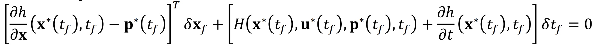
- Could be one of a bunch of others though
  - WHOLE TABLE of them

**Optimal trajectory (bounded)** - Pontryagin's Minimum Principle
- Optimal trajectory
  - Same $x^*$ and $p^*$ conditions
  - optimal input $u^*$ minimizes the Hamiltonian at $x^*$ and $p^*$ at every instant
    - NOT according to the condition in unbounded
  - Same as other optimality conditions of bounded

**Some problems**
- **Minimum time** $\rarr$ bang-bang control
- **Minimum fuel** $\rarr$ bang-off-bang control
- **Minimum energy** $\rarr$ linear and then "saturated" (this is just LQR but input)

### Numerical
$\texttt{scipy.solve\_bvp}$
- If no final time, it is added as a part of state vector with no dynamics

[AA 203 Lecture 5 code](https://github.com/StanfordASL/AA203-Examples/blob/master/Code_for_lecture_5.ipynb)

## Direct methods
- ***Discretize THEN optimize***
  - Use dynamics with Euler (1st order) discretization
- Get finite set of input points to optimize over
- Directly optimize control trajectories
  - Choose effective controls based on dynamics and limitations
    - e.g. Euler, Runge-Kutta, Trapezoidal, Hermite-Simpson methods?
  - Do not require the appearance of *special expressions* (?)
- Strengths
  - Complex dynamics
  - High-dim state/control spaces
  - Intricate constraints (state, control, path, boundary)
- ALGEBRAIC

[AA 203 Lecture 6 code](https://github.com/StanfordASL/AA203-Examples/blob/master/Code_for_lecture_6.ipynb)

### Shooting
- Idea
  - Tracks/optimizes only the N values of $u$
  - In constraints function, propagate state all the way through
  - Constraints (INEQUALITY)
    - State bounds (during the shooting)
    - Terminal state
  - Input bounds
  - Cost (just on input)
- Dynamics enforced by construction
  - (actually using them in the constraints calculation)
  - State is deterministic output of u
- Good
  - Fewer parameters to optimize over
  - For having simulator
  - Short/moderate time horizon
- Bad
  - $u$ sensitivity HIGH
  - Can't guess trajectory, just input
  - Unstable/marginally stable dynamics
  - Can't parallelize since it's sequential

### Simultaneous 
- Idea
  - Tracks/optimizes a 1D array of all $x$ and $u$ values unraveled
    - For 2D trajectory that's (3N+2)
      - 2*(N+1) + N for both dimensions from [0,tN] but then input from [0,tN-1]
  - Constraints (EQUALITY)
    - Dynamics (between subsequent states)
    - Initial/terminal conditions
  - Bounds
    - For state AND control since they are both being tracked
  - Cost (just on input)
- Dynamics enforced by the equality of constraints
  - State is free variable to optimize otherwise
- Good
  - Each timestep is a constraint
  - Can start with a guess trajectory
  - Handles path constraints easily
  - Parallelizable
- Bad
  - Larger problem
  - Need nonlinear solver for equality constraints
  - Need to fully converge for a dynamically-feasible trajectory

indirect/direct methods, cost functions, LQR/iLQR/DDP, constrained optimization (penalty/barrier/augmented Lagrangian/SQP)

## Random

### Gradient Descent
- Matrix of $D$ governs order and magnitude of descent
- 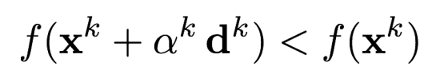
- 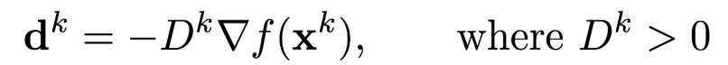
- 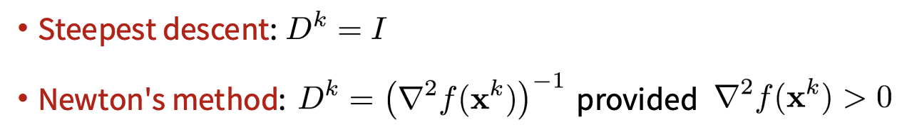

chance-constrained trajectory opt, covariance steering, reachability analysis

# DDP
- Curvature of dynamics
  - full newton
- not just cost
- dynamics hessian so expensive

# LQR
- Gauss-newton (drops curvature)

## Derivation

## iLQR

# Optimization

- Indirect methods
  - Pontryagin's Minimum Principle
  - necesary conditions for optimality
- Direct methods
  - discretize THEN optimize
  - shooting, collocation
- Cost functions