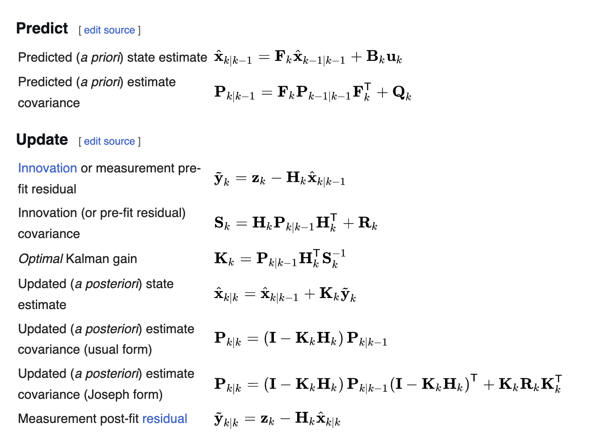
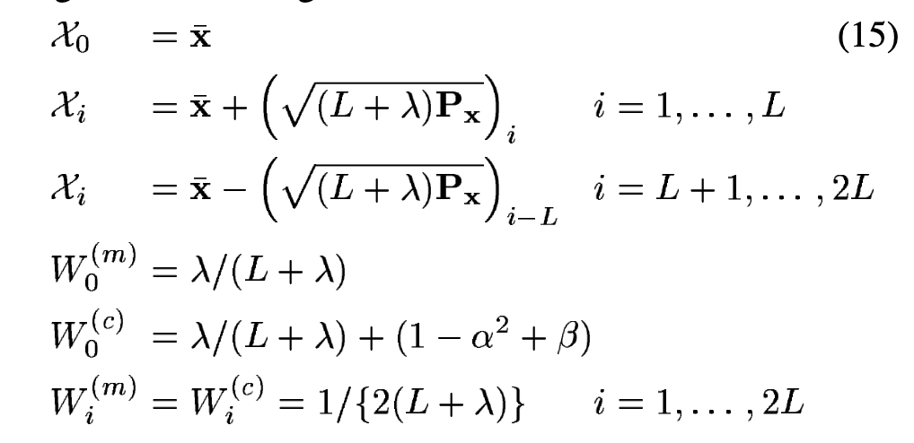
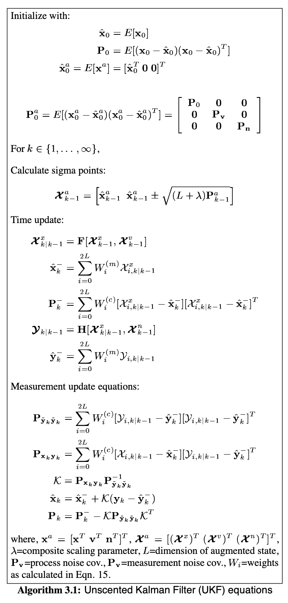
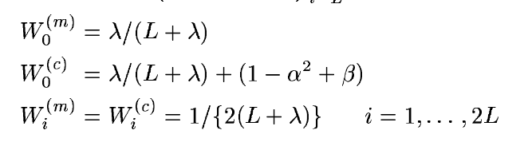
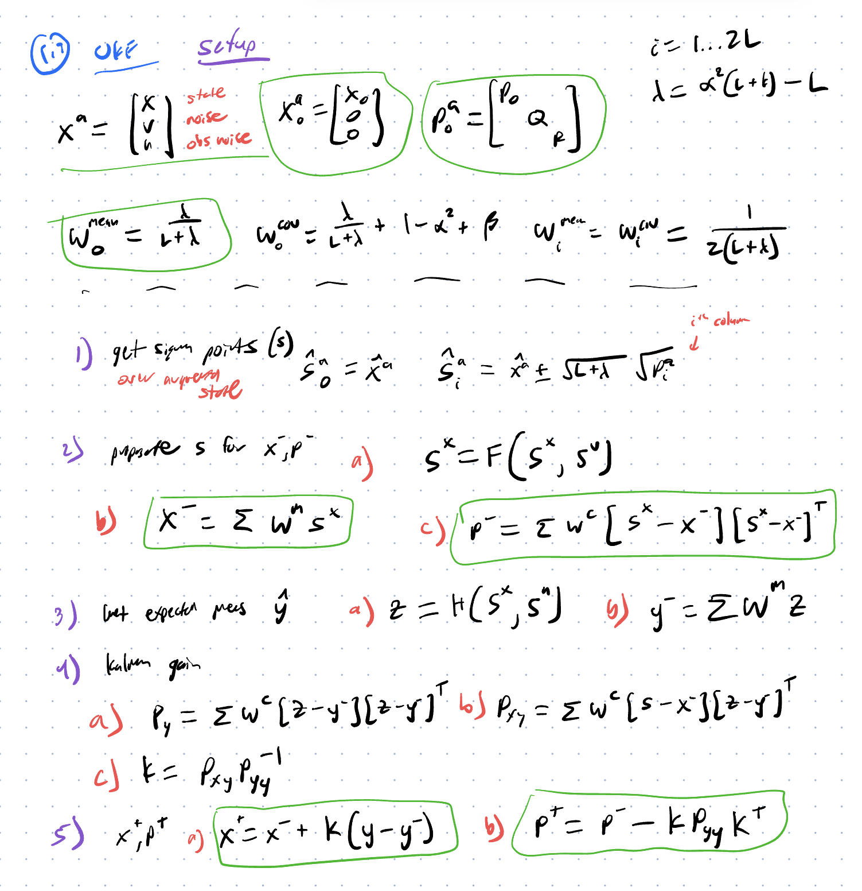
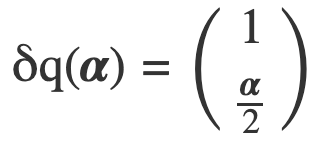
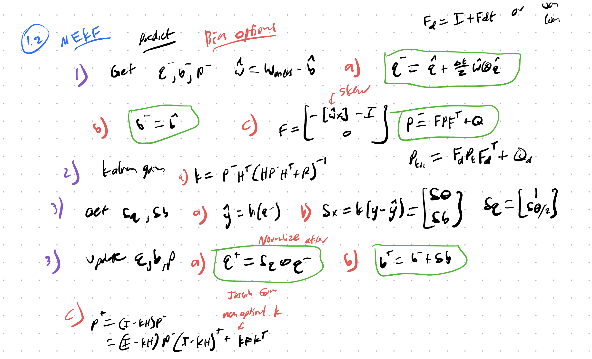
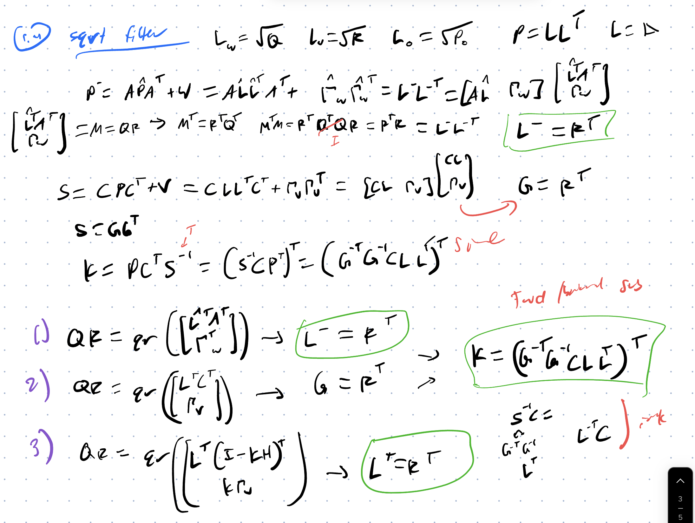
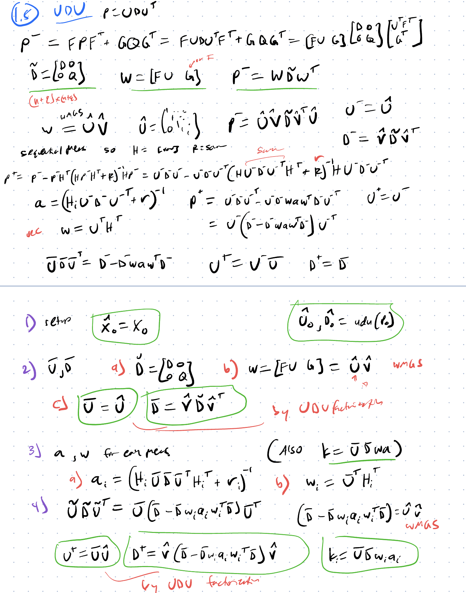

# Kalman 

## KF
- Prediction and update phase
- Can ONLY use zero-mean Gaussian distributions for noise
  - If so, best minimum mean square error estimator
- EXACT SOLUTION for linear-Gaussian

[Link](https://arxiv.org/pdf/1910.03558)

### History
- Called Kalman-Bucy filter
- Stanley Schmidt put in onto Apollo

### Overview
- Uses dynamic model (state space), control inputs, and measurements
- sensor and data fusion
- With LQR, solves linear quadratic gaussian problem

### Derivation
- First moment (mean) and second moment (variance) of the Gaussian distribution
- Assumptions
  - **Linearity**
  - State space
    - no D matrix (feedforward)
  - **Gaussian** noise
  - Uncorrelated noise
  - Must know noise covariances

### Joseph form
[paper](https://sites.utexas.edu/near/wp-content/uploads/sites/6030/2017/04/CUKF_ver06.pdf)
- Valid for nonoptimal K (but who tf uses that)
  - So probably for EKF since it's only a linearization

## EKF
- Nonlinear estimate around the current state
- Covariances of state and measurement are jacobians at that state
- First order Taylor expansion
  - **Breaks down for strong nonlinearities or large initial uncertainty**
  
## UKF
- Propagate small set of sigma points through the nonlinear function
- Get new mean and covariance out of that
- Recombine with fixed weights
- No jacobians
- but more function evaluations at each step
- SQUARE ROOT OF COVARIANCE
  - cholesky decomposition (requires PD cov matrix)
- Math
  - Mean weight double the others
  - Covariance weight the same but with (1 - alpha^2 + beta), tuning parameters
  - All other points are 1 (2*(L+lambda)) where lambda is (alpha^2 * (L+kappa))
    - alpha is spread of points around mean, very small
    - kappa in corporates prior knowledge
    - beta optional
- 

### Steps

Setup
1. Calculate Weights
   1. Note that the non-center points have the same weights
   2. Center point has some other factor for cov
   3. 

#### Running
[Source](https://groups.seas.harvard.edu/courses/cs281/papers/unscented.pdf)
1. Get sigma points by adding some multiplicity of square root of COV matrix (so s.d)
2. Time update
   1. *Propagate points* with f()
   2. *Update mean* with transformed points and weights
      1. Get its covariance from this
   3. *Calc expected meas* with h() and weights
      1. Get its covariance from this ($P_{y,y}$)
3. Measurement updates
   1. *Get cross covariance* ($P_{x,y}$)
   2. *Update prediction* with kalman gain and and meas
   3. *Update cov* with kalman gain and $P_{y,y}$

Setup

* xa = [x v n]' (augmented state)
   * sigma points are Sa = [Sx Sv Sn]'
* xa_0 = [x0 0 0]'
* Pa_0 = diag[P0 Q R]
* lambda = alpha^2 * (L + kappa) - L
* W0_mean = lambda/(L + lambda)
* W0_cov = lambda/(L + lambda) + 1 - alpha^2 + beta
* Wi_mean = Wi_cov = 1/2/(L+lambda)

My summary

1. Get sigma points
   1. Sa0 = Sa_0 (for mean)
   2. Sa_i = xa + [sqrt((L+λ)Pa)]_i and Sa_i = xa − [sqrt((L+λ)Pa)]_(i₋L) for i = L+1...2L
      1. sqrt(Pa_i) is of the ith column. could be of the ith diagonal element (good)
2. Propagate s for x-, P-
   1. Sx = F(Sx, Sv)
   2. x- = Sum(W_mean * Sx) (generalized for mean and all points)
   3. P- = Sum(W_cov*(Sx - x-)*(Sx - x-)')
3. Get expected meas
   1. Z = H(Sx, Sn)
   2. y_exp = Sum(W_mean * Z)
4. Kalman gain
   1. P_yy = Sum(W_cov * (Z - y_exp)*(Z - y_exp)')
   2. P_xy = Sum(W_cov * (Sx - x-)*(Z - y_exp)')
   3. K = P_xy * inv(P_yy)
5. Update
   1. x = x- + K(y_meas - y_exp)
   2. P = P- - K Pyy K' = P- - P_xy inv(P_yy) P_xy' (since P_yy is symmetrical the transpose of the inverse is the inverse

**TODO**: Make UKF in code

## MEKF
- Better with orientation because error quaternion instead of adding it
  - Only vector part parametrizes
  - Twice a is the principal rotation vector
  - 
- Avoids norm preservation and over-parameterization

[good paper](https://ntrs.nasa.gov/api/citations/20040037784/downloads/20040037784.pdf)

My summary

1. Get a priori.
   1. w_hat = w_meas - b_hat
   2. q- = q_hat + dt/2 * hat(w_hat) (x) q_hat
   3. b- = b_hat
   4. F = (as you showed)
   5. P- = F@P@F'+ Q
2. Kalman gain
   1. K = P-@H'@inv(H@P-@H' + R)
3. Get dq, db
   1. y_hat = h(q-)
   2. dx = K(y_meas - y_hat) = [dtheta; db]
   3. dq = [0; dtheta]
4. Update q,b,P
   1. q = dq (x) q-
   2. b = b- + db
   3. P = (I-K@H)@P-
      1. OR P = (I - K@H)@P-@(I - K@H)' + K@R@K' (joseph form since impossible for K to be optimal since there are always nonlinearities in reality)

## Square root filter
- Big idea
  - Have $P = SS^T$
  - Instead of $P^- = A_dPA_d^T + Q$ 
     - Run QR decomposition on a stacked vector of things
  - Process scalar measurements one at a time
- Good
  - Numerical errors have half the effect
- Cost
  - QR / Cholesky
- Guarantees PSD of Q

[paper](https://arxiv.org/pdf/2208.06452)

Hard

## UDU Kalman Filter

<!-- [Link](https://pmc.ncbi.nlm.nih.gov/articles/PMC11124921/pdf/sensors-24-03048.pdf) -->
[Summary](https://arxiv.org/pdf/2203.06105)

- Guarantees PSD of Q
- REQUIRES diagonal R
  - Single measurement updates
- $P = UDU^T$ where $U$ is upper triangular with 1's on the diagonals, and $D$ is diagonal
- UD factorization doesn't require square root (only +, *, /)
- Uses Thornton's algorithm (weighted modified gram-schmidt orthogonalization)
- But
  - Required diagonal R
    - could do whitening transformation 
  - Less intuitive to modify
  - degenerate D

My Summary
- Note that you have to do steps 3-4 for each measurement scalar (which is crazy)

TODO
# Consistency
- NIS
- NEES
- chi-square test

## Observability
- Grammian

## Q/R Gain Tuning
- Scaling 