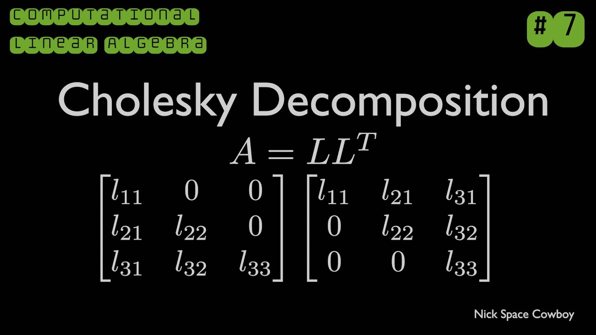
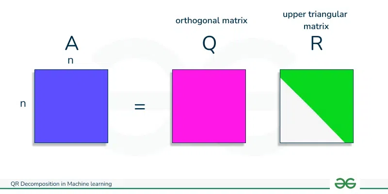
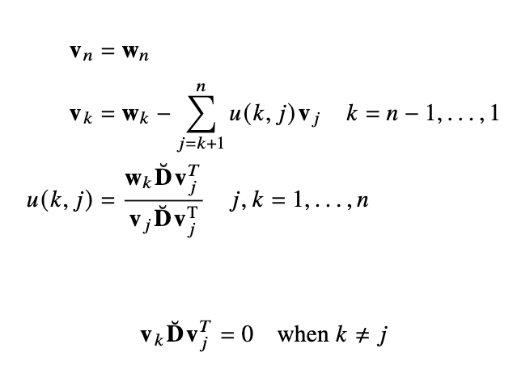

TODO: all

# [Van load's method](https://arxiv.org/pdf/2505.18187)

TODO

# Decompositions

## Cholesky
- Matrix becomes product of lower triangle matrix and transpose
- Makes solving $Ax = b$ easy
  - $Ax = L(L^*x)$  $= b$
  - $Ly = b$
  - $x = (L*)^{-1}b$

[wiki](https://en.wikipedia.org/wiki/Cholesky_decomposition)

## QR factorization

- $Q^{T}Q = I$
- $L$ is upper triangular

## Modified Agee turner

## Graham Schmidt

### Modified

### Weighted Modified 
- By rows $w_i$ of $W$

## Principal Rotation Vector