# Orbital Mechanics

## Two-body problem
- Orbits in a plane
- Specific energy is the same
  - Negative energy for in gravity well

### Classical Orbital Elements
- $a$ - semi major axis
- $e$ - eccentricity (elongation)
  - 0 - circular
  - 0-1 - ellipse
  - 1 - parabolic
  - \>1 - Hyperbolic
- $i$ - Inclination
  - 0-90º - Prograde
  - 90º-180º - retrograde
- $\Omega$ - Right ascension of ascending node (RAAN)
  - Where orbit crosses "zero" plane going up
- $\omega$ - Argument of periapsis
  - Periapsis location w.r.t RAAN
- $\theta$/$\nu$ - True anomaly
  - Also use $M$ for mean anomaly or $E$ for eccentric anomaly
- Degenerate cases
- Circular orbit
  - $e$ = 0
  - Periapsis is undefined
  - Argument of latitude used ($u = \omega + \nu$)
- Equatorial orbit
  - $i$ = 0
  - RAAN is undefined
  - Longitude of periapsis ($\bar{\omega} = \Omega + \omega$)
  - Basically just argument of periapsis w.r.t X axis of coords
- Circular AND equatorial
  - True longitude is used $l = \nu + \bar{\omega}$

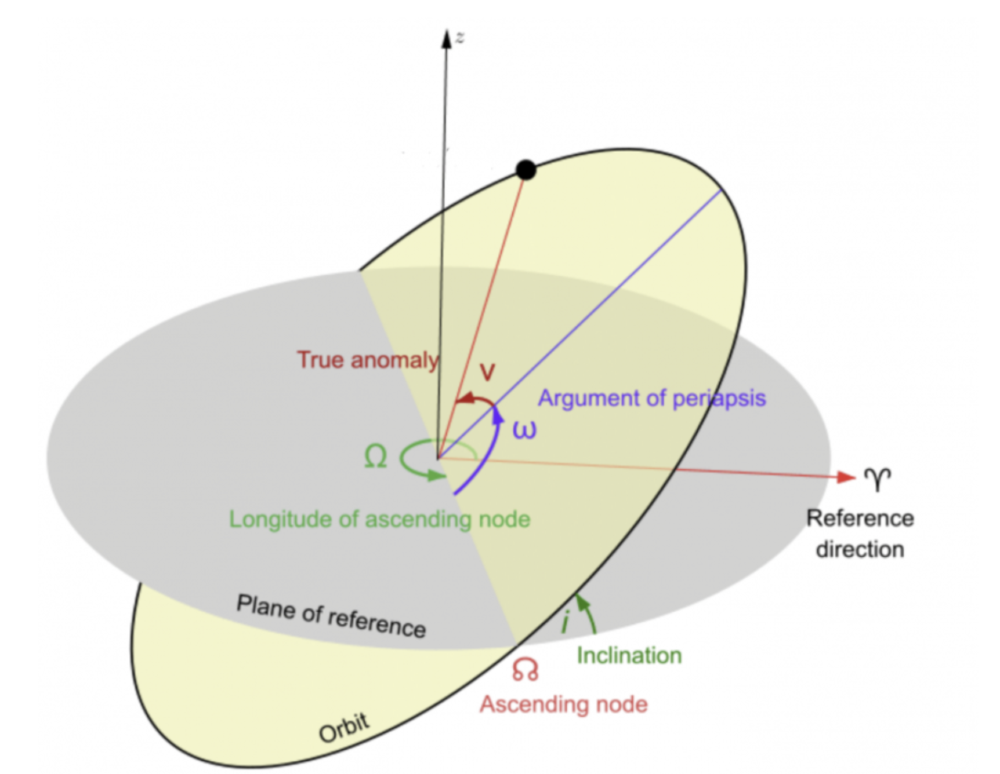

**Modified Equinoctial Elements** (Just know they exist)
[Degenerate Conic article](https://degenerateconic.com/modified-equinoctial-elements.html)

**Kepler's Equation**
$M = E - e\ sin(E)$

**Vis-viva Equation**
[wikipedia](https://en.wikipedia.org/wiki/Vis-viva_equation)
Useful for $\Delta v$ checks

## Orbital Perturbations
There was a slideshow in AA 278 that I can't find. Bolded for important.
- [Spherical harmonics](https://en.wikipedia.org/wiki/Spherical_harmonics)
  - **[J2 (oblateness)](https://control.asu.edu/Classes/MAE462/462Lecture13.pdf)**
    - Earth's equatorial bulge causes secular (long-term, low) drift drift of RAAN and AOP
  - Higher zonal harmonics (J3, J4, J5)
    - Orders of magnitude smaller than J2
  - Tesseral/sectoral
    - Why GEO needs stationkeeping too
    - 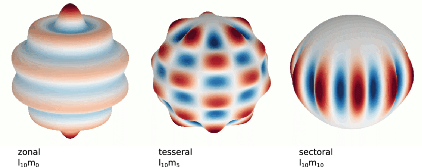
- **Third-body**
  - Sun, Moon, etc.
  - Relevant for cis-lunar 
    - 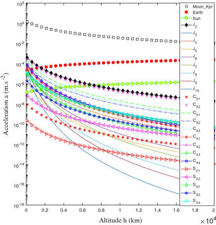
  - Negligible in LEO due to Earth gravity
- Tides
- Relativistic
- **Atmospheric drag**
  - Decay in $a$ and also depends on ballistic coefficient and atmospheric density
  - Mainly in LEO
- **Solar radiation pressure**
  - Reflected sunlight/radiation
- Albedo / IR radiation pressure
  - Same as SRP but from Earth or Moon
- Outgassing / thermal effects
  - Spacecraft's own materials/thrusters, notoriously affected early GPS orbit solutions before well modeled

### Lagrange points
- L1, L2, L3 colinear but unstable
- L5, L4 stable
- Webb orbits around L2
  - "Halo/libration-point orbits"
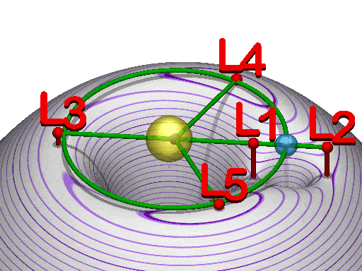

### Perturbations

### Restricted three-body problem & Lagrange points
- CR3BP: two large primaries in circular orbits about their barycenter, a massless third body moving under both gravities
- 5 Lagrange points: L1/L2/L3 (collinear, unstable), L4/L5 (triangular, stable for suitable mass ratios)
- Halo/libration-point orbits around L1/L2 — periodic or quasi-periodic, relevant to cislunar/gateway-type missions. Worth knowing this exists and roughly why it's useful (low-energy transfers, persistent lunar-adjacent coverage) even without deriving it.

Earth orbit
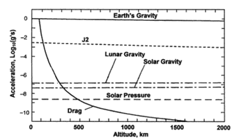

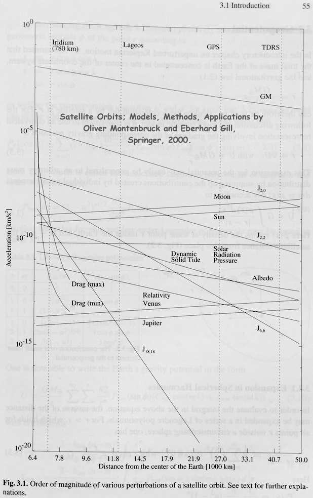

High altitude
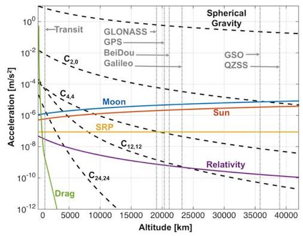

With Moon Orbit
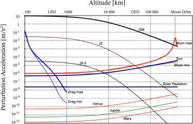

## TLE (two-line elements)
**Line 0**
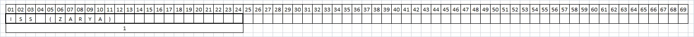
- Satellite name

**Line 1**
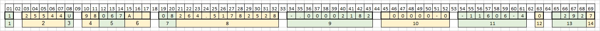
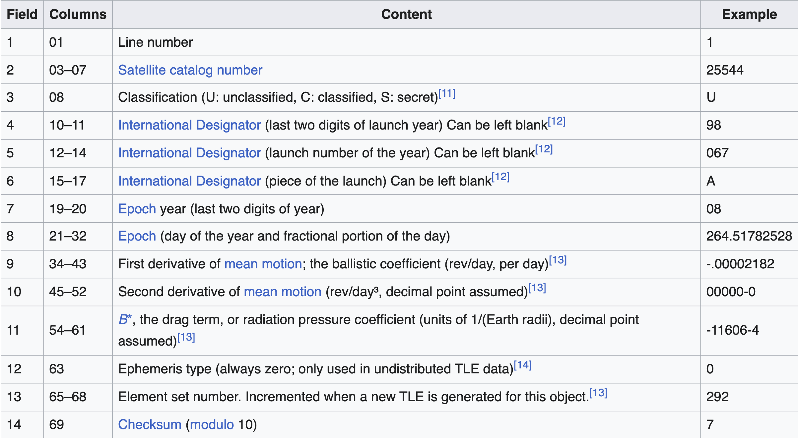
- Time, designation

**Line 2**
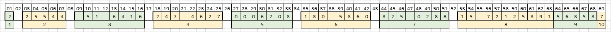
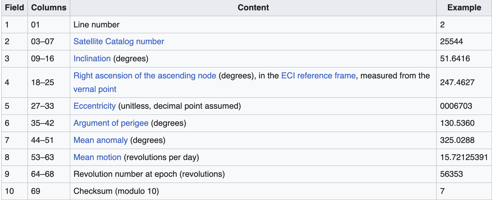
- Orbital elements

### SGP4
- Simplified General Perturbation
  - Inputs of TLE

## Hill / Clohessy-Wiltshire equations
- Orbital motion **relative** to a target in orbit
  - Rotating reference frame
- Don't need to propagate both sats
- Interesting things
  - Out-of-plane $z$ motion is simple harmonic motion (which makes sense when you think about intersecting nodes and a fixed inclination)
  - $x$ and $y$ motion are coupled
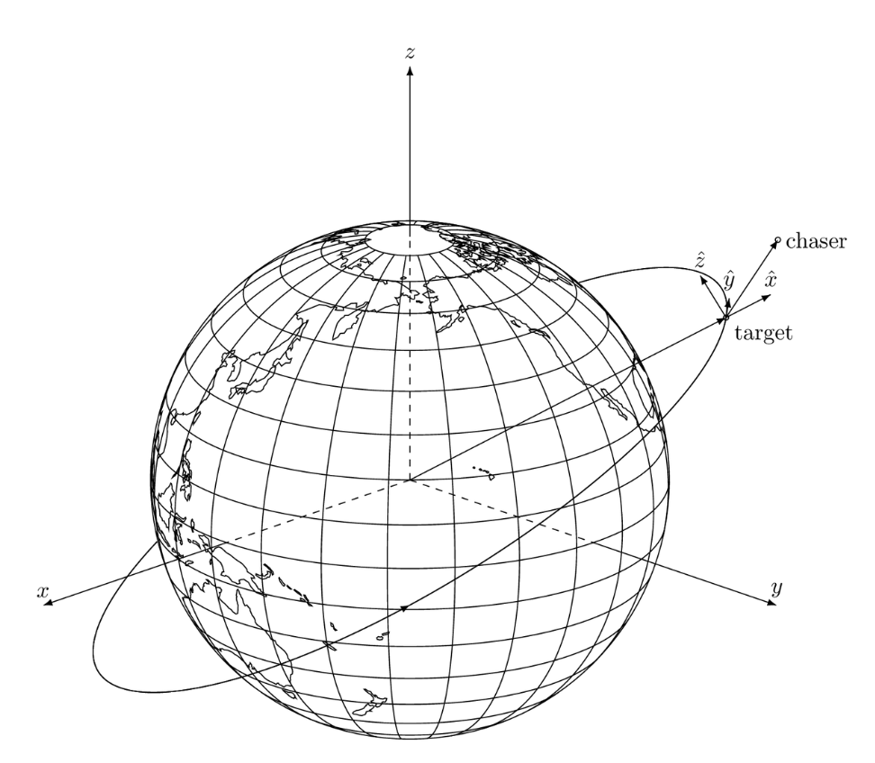

### Derivation of equations
- ASSUMPTIONS
  - Circular orbit
    1. $r << r_t$ aka distance from the target is much less than the target's orbital radius (duh)
    2. $
 1. $\dot{\omega} = 0$ cancels out Euler term in rotating acceleration
    1. $\omega \perp r$ so no $sin$ term appears in the Coriolis term. Kinda? idk
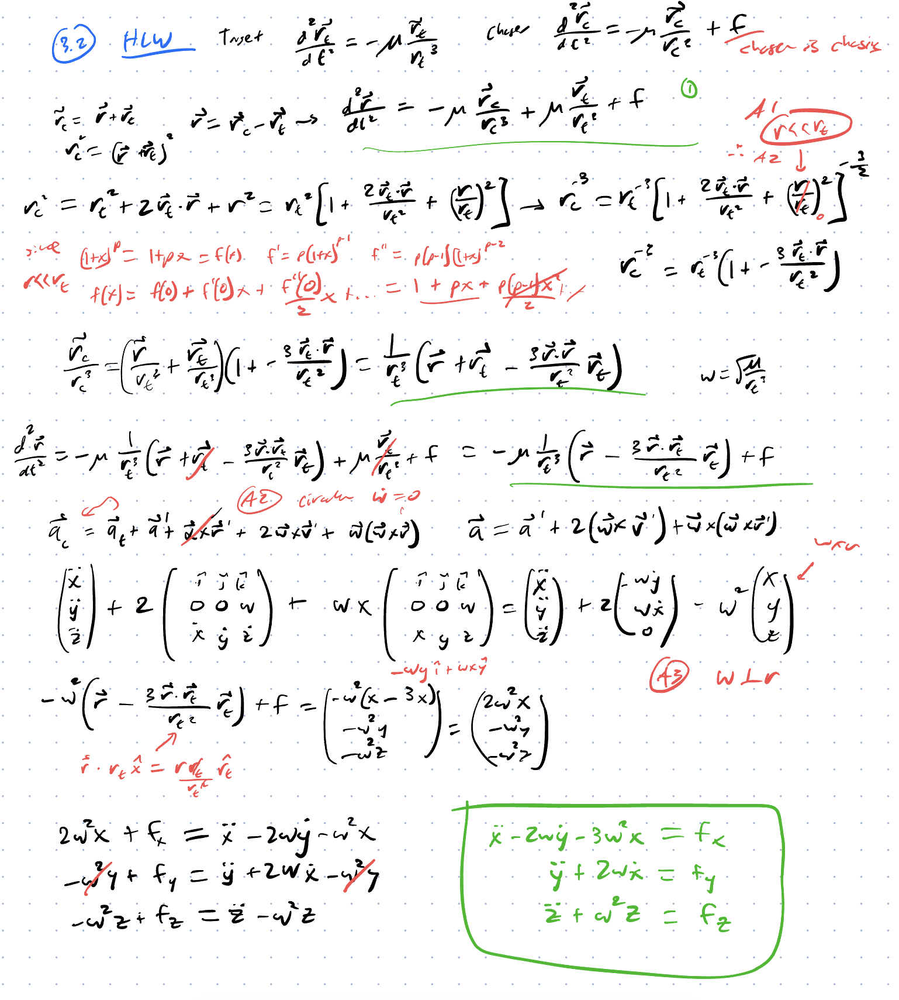
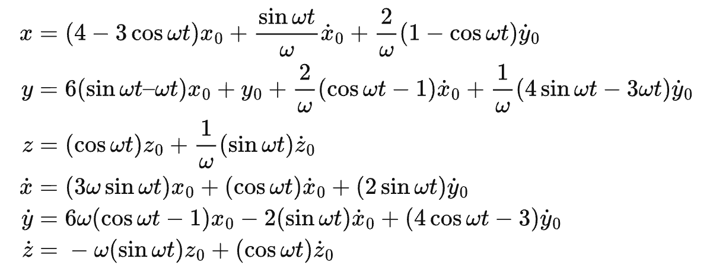
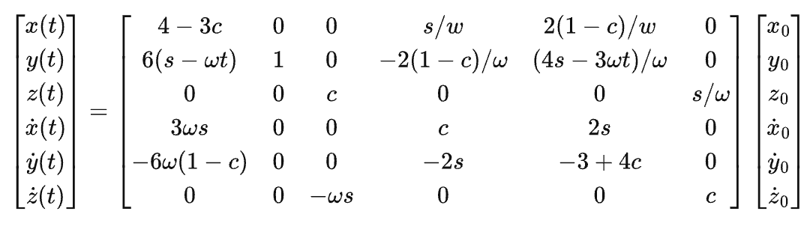
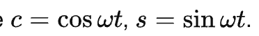

- Goal: describe a chaser's motion *relative* to a target on a circular reference orbit, without propagating full two-body dynamics for both bodies separately
- Result: in-plane (x, y) motion couples through the orbital rate n; out-of-plane (z) motion decouples into a simple harmonic oscillator
- Natural motion: in-plane relative orbits trace 2:1 ellipses around the target *unless* there's a net along-track drift term — always check for that drift term when reading a relative trajectory
- Key limitation: only valid for a circular (or near-circular) reference orbit and small relative separation. Eccentric references need the extended Tschauner-Hempel / Yamanaka-Ankersen formulations.

Links
- [Paper](https://sci-hub.ru/10.2514/8.8704)
- [Derivation (easy because they don't do it in the paper)](https://ensatellite.com/hills-equations/)

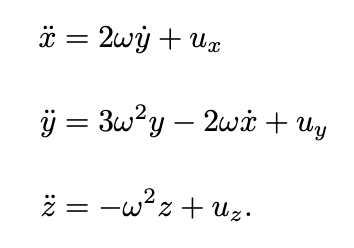

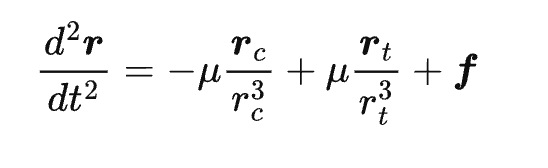
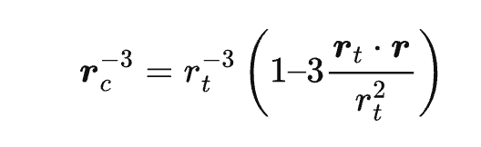
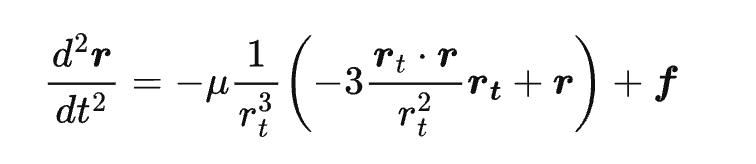

## Other rendezvous frames

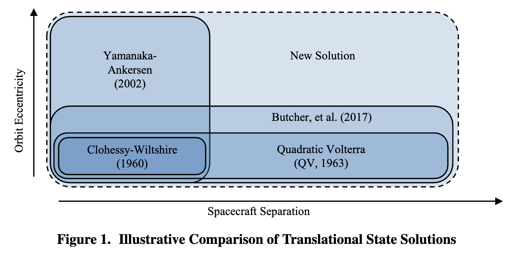

- Quadratic Volterra (QV)
- Yamanaka-Ankersen (YA)
- Butcher et al.
- Some new solution (huge)
  - ([D'Amico's paper](https://slab.sites.stanford.edu/sites/g/files/sbiybj25201/files/media/file/asm2019_willislovelldamico_final.pdf))

## Common and useful orbits

TODO

## Kepler's laws

## Lambert's problem

## Different orbits

## Trajectories TO moon and stuff

